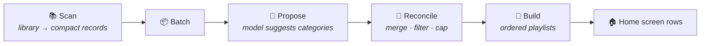

<div align="center">

# 🎬 Curator

**A Jellyfin plugin that asks an LLM what your library has in common —<br/>and builds the answers into home screen rows.**

[](https://jellyfin.org)
[](https://dotnet.microsoft.com)
[](#-installation)

*Dumb & Perfect · Cerebral Sci-Fi · Comfort Rewatch ·<br/>Movies That Look Better Than They Are · Quietly Devastating · Saturday Afternoon Cable*

</div>

---

Curator is a scheduled task. It sends every movie and show in your library to a model you configure, asks it to find the threads running through them, and turns each thread into an ordered Jellyfin playlist — surfaced on your home screen as a row via Collection Sections.

The categories it produces are the ones a query can't express.

> **Status:** in active development. The core pipeline — scan → propose → reconcile → build playlists — is implemented and tested; home screen auto-registration and the scheduled task are landing next.

## 🎯 Scope

Curator does exactly one thing: **LLM-inferred vibe categories.**

It deliberately does *not* build categories from metadata fields or external data sources. If you want "Directed by Wes Anderson," "Unwatched Action Movies," or "2026 Emmy Winners," those are rule-based and external-list problems that [SmartLists](https://github.com/jyourstone/jellyfin-smartlists-plugin) already solves well. Curator is designed to sit alongside it, not replace it.

The bet is that the interesting gap in the Jellyfin ecosystem isn't *more ways to filter* — it's the categories that require taste.

## 🧠 How it works



**1. Scan.** Every movie and series in the library is collected and reduced to a compact record: title, year, genres, tags, official rating, runtime, community rating, a truncated overview, and its Jellyfin item ID. No file paths or account details are ever sent. Watch history stays local too, with one opt-out exception: when **personalized playlists** are enabled (the default for playlist output), each target user's watch activity — played state, play count, favorites, personal rating — is attached so the model can shape categories to their taste. Turn the toggle off and nothing about viewing behavior leaves the server.

**2. Batch.** The records are chunked to fit the configured model's context window. A large library will span many requests.

**3. Propose.** Each batch is sent to the model, which returns proposed categories: a name, a one-line description, and the list of item IDs that belong to it. The model may only reference IDs supplied in that batch. Any ID it returns that wasn't in the input is discarded — this is what prevents it from confidently adding a movie you don't own.

**4. Reconcile.** Because each batch only sees a slice of the library, proposals overlap and duplicate across batches. A reconciliation pass merges near-identical categories (fuzzy name match plus member overlap), drops categories below a minimum size, caps the total number of categories, and produces the final set.

**5. Build.** Each surviving category becomes a Jellyfin playlist, ordered by the model's confidence ranking. Curator then registers a matching home screen section and enables it for your users.

## ⚙️ Configuration

### Model

Set in the plugin's configuration page:

| Setting | Description |
|---|---|
| **Provider** | Anthropic, OpenAI, or any OpenAI-compatible endpoint (Ollama, LM Studio, vLLM, OpenRouter — Gemini works via Google's OpenAI-compatible API) |
| **Model** | The model identifier to use |
| **API key** | Stored in the plugin configuration; optional for local OpenAI-compatible servers |
| **Base URL** | Optional override for self-hosted or proxied endpoints; required for the OpenAI-compatible provider (e.g. `http://localhost:11434/v1`) |
| **Batch size** | Items per request. Lower this if you hit context limits |
| **Max output tokens** | Output cap per request. Raise it if batch responses get truncated |
| **Max categories** | Ceiling on how many categories a run may produce |
| **Min category size** | Categories with fewer members than this are discarded |
| **Token budget** | Hard cap per run, so a large library can't run up an unexpected bill |
| **Input / output cost per million** | Your provider's prices, used only for the estimated-cost log line; leave at 0 to log token counts alone |

> [!IMPORTANT]
> **A note on what gets sent.** Curator transmits your library's titles and metadata to whatever provider you configure — and, when personalized playlists are enabled, each target user's watch activity too. With a hosted provider, that means a third party sees a list of everything you own and how you watch it. If that's not acceptable, disable personalization, or point Curator at a local model using the base URL override — then nothing leaves your network.

### Output

| Setting | Description |
|---|---|
| **Output type** | Playlists (default) or collections |
| **Personalized playlists** | Attach each target user's watch activity so their playlists reflect their taste. Playlists only; runs the model once per user, so cost scales with user count |
| **Include episodes** | Allow the model to select individual episodes, not just whole series |
| **Target users** | Which users get playlists generated for them (empty = all users) |
| **Auto-enable sections** | Enable newly created sections on the home screen automatically |

## 🎵 Playlists, collections, and ordering

**Curator defaults to playlists, and you should probably leave it that way.**

Collection Sections renders a collection row by taking the first 16 children in whatever order Jellyfin returns them — there is no ordering hook. You cannot control which 16 of a 40-item category appear.

Playlists preserve explicit order, so Curator controls both the sequence and, by extension, which items make the visible cut.

The usual objection to playlists is that adding a series inserts its episodes individually. That objection doesn't apply here: Collection Sections' playlist handler groups episodes back into their parent series before rendering, so a playlist of individual episodes displays as **series cards**, deduplicated, in playlist order. Inside the library UI the playlist still shows episodes — that's the tradeoff — but the home screen row looks correct.

This also unlocks episode-level categories that collections simply cannot express: **Bottle Episodes**, **The Halloween Ones**, **Episodes That Broke People**.

Note that Jellyfin playlists are user-scoped. One category becomes one playlist per targeted user, and Curator tracks the per-user playlist IDs internally.

## 🏷️ Ownership and tagging

Every playlist and collection Curator creates is tagged in its metadata as plugin-created, alongside the run timestamp and the model that generated it.

This means:

- Curator resolves its own lists by stored GUID on subsequent runs, updating them rather than creating duplicates.
- Lists you created by hand are never modified or deleted, even if the name collides with one Curator would generate.
- You can purge everything Curator has made in a single action without touching the rest of your library.
- Removing the tag from a list hands it to you permanently — Curator will stop managing it.

When a category stops matching anything, Curator removes the Jellyfin playlist but keeps the category definition, and recreates the playlist if the category becomes populated again.

## 🏠 Home screen integration

Curator registers its categories as Collection Sections entries and can enable them for users automatically, so a new category appears on the home screen without anyone visiting a settings page.

If you'd rather approve categories before they go live, disable **Auto-enable sections** and they'll appear in Modular Home settings as available-but-off.

## 📦 Installation

### Prerequisites

1. A Jellyfin **10.11.x** server.
2. [Home Screen Sections](https://github.com/IAmParadox27/jellyfin-plugin-home-sections) installed and working — follow its guide first, including enabling modular home in your user settings.
3. [Collection Sections](https://github.com/IAmParadox27/jellyfin-plugin-collection-sections) installed on top of it.
4. An API key for Anthropic or OpenAI, **or** a local OpenAI-compatible endpoint (Ollama, LM Studio, vLLM).

### Install the plugin

There is no plugin-catalogue repository yet, so installation is a folder drop:

1. Grab a packaged build — either from the repository's releases, or build one yourself (next section). Either way you end up with a folder containing `Jellyfin.Plugin.Curator.dll` and `meta.json`.
2. Copy that folder into your server's plugin directory as `plugins/Curator_<version>`:

   | Setup | Plugin directory |
   |---|---|
   | Podman/Docker (config dir mounted at `/config`) | `<your config mount>/plugins/Curator_0.1.0.0/` |
   | Linux package | `/var/lib/jellyfin/plugins/Curator_0.1.0.0/` |
   | Windows | `%ProgramData%\Jellyfin\Server\plugins\Curator_0.1.0.0\` |

3. Make sure the files are readable by the Jellyfin user (for containers, match the UID the container runs as).
4. Restart Jellyfin. **Dashboard → Plugins** should now list Curator as Active.
5. Open Curator's configuration page, choose a provider and model, and enter your API key (or base URL for a local endpoint).
6. Run the **Curator: Generate Categories** scheduled task manually for a first pass, and watch the server log — every run logs its token count and estimated cost at INFO.

### Building from source

Requires the .NET 9 SDK.

```bash
git clone https://github.com/nitramivel/jellyfin-curator
cd jellyfin-curator
dotnet test                # full test suite; no network access needed
./build/package.sh         # produces artifacts/Curator_<version>/ ready to copy
```

`build/package.sh` accepts `VERSION` and `TARGET_ABI` environment variables if you need to pin either.

## ⚠️ Caveats

- **LLM output is not deterministic.** Two runs over the same library will not produce identical categories. This is arguably the point, but it means categories churn between runs. To keep a playlist you love exactly as it is, remove its `curator` tag — Curator hands it to you permanently and never touches it again.
- **Cost scales with library size.** A 3,000-item library is a lot of tokens per run. Set a token budget and start with a wide schedule.
- **The model can be wrong about your media.** It sees a title and an overview, not the film. It will occasionally group things confidently and incorrectly.
- **Collection Sections resolves rows by name.** Renaming a Curator playlist by hand will break its home screen section.

## 🙏 Credits

Home screen integration builds on [Home Screen Sections](https://github.com/IAmParadox27/jellyfin-plugin-home-sections) and [Collection Sections](https://github.com/IAmParadox27/jellyfin-plugin-collection-sections) by [IAmParadox27](https://github.com/IAmParadox27). Architectural patterns — list storage, ownership by GUID, ordering strategies, refresh queueing — were informed by [SmartLists](https://github.com/jyourstone/jellyfin-smartlists-plugin) by [jyourstone](https://github.com/jyourstone).
