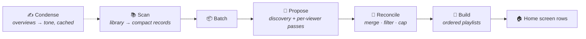

<div align="center">

# 🎬 Curator

**A Jellyfin plugin that asks an LLM what your library has in common —<br/>and builds the answers into home screen rows.**

[](https://jellyfin.org)
[](https://dotnet.microsoft.com)
[](#-installation)

*Dumb & Perfect · Cerebral Sci-Fi · Comfort Rewatch ·<br/>Movies That Look Better Than They Are · Quietly Devastating · Saturday Afternoon Cable*

</div>

---

Curator is a scheduled task. It sends every movie and show in your library to a model you configure, asks it to find the threads running through them, and turns each thread into an ordered Jellyfin playlist — surfaced on your home screen as a row via Collection Sections.

The categories it produces are the ones a query can't express.

> **Status:** running against a live Jellyfin 10.11.11 server. The full pipeline — scan, propose, reconcile, build playlists, publish home screen rows — completes from the scheduled task or the configuration page's **Generate categories now** button, and every run writes a complete record you can read afterwards.
>
> Still being tuned: how stable category names are between runs, and how shared categories should be distributed to users who have watched very little.

## 🎯 Scope

Curator does exactly one thing: **LLM-inferred vibe categories.**

It deliberately does *not* build categories from metadata fields or external data sources. If you want "Directed by Wes Anderson," "Unwatched Action Movies," or "2026 Emmy Winners," those are rule-based and external-list problems that [SmartLists](https://github.com/jyourstone/jellyfin-smartlists-plugin) already solves well. Curator is designed to sit alongside it, not replace it.

The bet is that the interesting gap in the Jellyfin ecosystem isn't *more ways to filter* — it's the categories that require taste.

## 🧠 How it works



**1. Scan.** Every movie and series in the library is collected and reduced to a compact record: title, year, genres, tags, official rating, runtime, community rating, a truncated overview, and its Jellyfin item ID. No file paths or account details are ever sent. Watch history stays local too, with one opt-out exception: when **personalized playlists** are enabled (the default for playlist output), each target user's watch activity — played state, play count, favorites, personal rating — is attached so the model can shape categories to their taste. Television counts: Jellyfin records playback against episodes and leaves a series' own watch history empty, so episode plays are rolled up onto the parent series and reach the model as watch depth ("140 of 201 episodes"). Without that, anyone who mostly watches TV reads as someone who has watched nothing. Turn the toggle off and nothing about viewing behavior leaves the server.

**2. Batch.** By default the whole library goes in one request. A thread running through items split across two batches is one the model never gets to see — each call only sees its own slice — so batching is a workaround for a context that cannot hold the library, not something to want. Set a batch size only if you hit context limits.

**3. Propose.** Each batch is sent to the model, which returns proposed categories: a name, a one-line description, and the list of item IDs that belong to it. The model may only reference IDs supplied in that batch. Any ID it returns that wasn't in the input is discarded — this is what prevents it from confidently adding a movie you don't own.

**4. Reconcile.** Because each batch only sees a slice of the library, proposals overlap and duplicate across batches. A reconciliation pass merges near-identical categories (fuzzy name match plus member overlap), drops categories below a minimum size, caps the total number of categories, and produces the final set.

> Both limits are **written into the prompt as well as applied afterwards**, so the model aims at the numbers it will be judged by. Raising the floor asks for fewer, broader categories rather than quietly binning most of what it returns; the ceilings tell the model how many categories to reach for and how large to let each grow. A cap the model cannot see is one it cannot aim at — given no target count, one model returned 23 categories covering 78% of the library while another returned 5 covering 10%, from an identical prompt.

> Categories are recognised across runs by their **members as well as their name**. Models reword the same theme every run — "Reality Coming Undone" becomes "Reality Is Optional" becomes "Glitch in the Reality Engine" — and matching on the name alone made every run tear down and rebuild every home screen row. A renamed category now keeps its playlist, its position and its watch state, and simply changes its label.

Curator also sets each row's placement in Home Screen Sections: **order index 500** for every row — one lane, leaving the arrangement around it to you — and a card shape from the category's size, landscape below the **portrait row threshold** and portrait at or above it (default 10). Everything else about a row (enabled, limits, hide-watched) is left as you set it.

**5. Build.** Each surviving category becomes a Jellyfin playlist, ordered by the model's confidence ranking. Curator then registers a matching home screen section and enables it for your users.

Shared categories go to **everyone**. They were once opt-in — each viewer's pass named the ones it wanted — and that collapsed in practice: the model declined 16 of 25 offers, and three of eight shared categories ended up built for a single user. A category drawn from the whole library belongs to the whole household; the per-viewer pass earns its keep by inventing, not by vetoing.

Items orphaned by a removed or renamed library folder never reach the model. Jellyfin keeps their database rows — same path, same media source — so they are indistinguishable from real items and play back as nothing; on one server 36 of 298 items were such ghosts, and they were landing in real playlists.

## ⚙️ Configuration

### Model

Set in the plugin's configuration page:

Curator keeps a **list of model profiles** rather than one set of credentials. A profile is everything needed to call one model — provider, model id, its own API key, an optional base URL, **its own prices**, and whether it thinks — and different parts of a run can be pointed at different profiles.

Pricing lives on the profile because a list you switch between turns "remember to change the prices when you change provider" from an occasional mistake into the normal case.

| Per-profile setting | Description |
|---|---|
| **Provider** | Anthropic (Claude), Google (Gemini), xAI (Grok), OpenAI (GPT), or any OpenAI-compatible endpoint (Ollama, LM Studio, vLLM, OpenRouter). Google and Grok constrain the model to this plugin's exact response shape, so a malformed answer cannot lose a batch — prefer their own entries over reaching them through the OpenAI-compatible endpoint, which gives that up |
| **Model** | The model identifier to use |
| **API key** | Stored in the plugin configuration; optional for local OpenAI-compatible servers |
| **Base URL** | Optional override for self-hosted or proxied endpoints; required for the OpenAI-compatible provider (e.g. `http://localhost:11434/v1`) |
| **Let this model think** | Follow the global setting, always, or never. Thinking counts against the output cap, so this is worth setting per profile: on a measured distillation pass it took most of the budget and cut three batches off mid-JSON, while the discovery pass with thinking *off* returned one usable category instead of twenty. Keeping the same model as two profiles — one thinking, one not — is how a run reasons where reasoning pays and stops where it does not |
| **Input / output cost per million** | That profile's prices, used only for the estimated-cost log line; leave at 0 to log token counts alone |
| **Cached input cost per million** | What the provider charges for input served from its prompt cache. **Blank means half the input price** — deliberately conservative, since it errs high rather than reporting a run as cheaper than it was. Anthropic bills cache reads at a tenth of the input rate; others are nearer a half, so set this explicitly on Anthropic |

**Which model runs which pass.** A run is two different jobs, and they need not use the same model:

| Assignment | What it covers |
|---|---|
| **Discovery pass** | One call over the whole library, looking for the threads that run through it. The hard half of the job, and a single call per run — so a stronger model here costs one call's worth |
| **Per-viewer passes** | One call for each viewer with enough history, **every run** — five of six calls on a measured run. This is the setting that actually moves the bill, and the narrower job |
| **Summaries** | The condensing pass, on the Summaries tab |
| **Recommendation ordering** | Only used if you switch model-ranked recommendations on |

Leave any of them blank to use the default profile.

| Request setting | Description |
|---|---|
| **Batch size** | Items per request. **0 (the default) sends the whole library in one request** — raise it off 0 only if you hit context limits |
| **Max output tokens** | Output cap per request. Raise it if batch responses get truncated. **Thinking counts against this**, which is the usual reason a response gets cut off |
| **Token budget** | Hard cap per run, so a large library can't run up an unexpected bill |

| Category setting | Description |
|---|---|
| **Items per shared row — fewest / most** | The size range for categories from the library-wide pass, `6` to `25` by default. Both ends are written into the prompt, so the model aims at the size it will be judged by. **The floor is the number that actually moves row length** — on a measured run all 60 categories came back at 5–10 items against a ceiling of 20, so the model sits near the floor it is given and the ceiling goes unused |
| **Items per personal row — fewest / most** | The same range for categories invented for a single viewer. Kept separate because a personal category is grounded in one person's history rather than the whole library, so this is the end to lower if invented categories start being padded or discarded |
| **Max shared / personal categories** | How many categories **one run** may propose. Told to the model as well as applied afterwards: a cap the model cannot see is one it cannot aim at — given no target count, one model returned 23 categories covering 78% of the library while another returned 5 covering 10%, from an identical prompt |
| **Rows to keep in total / per viewer** | How large a library of rows may accumulate **across** runs, as opposed to how many one run may propose. Set these above the per-run numbers to let good threads build up: with the two tied, every full run deletes something to make room, and a row deleted by the cap loses its identity and returns as a brand-new row rather than the one you had. **0 keeps them tied**, which is how Curator behaved before the settings were separated |
| **Min watched items to personalize** | How many items a user must have watched before they get a personalization pass. Defaults to 2; users below it are skipped before the request is sent and receive the shared categories instead. 0 personalizes everyone |
| **Send every collection an item belongs to** | On by default. Each item carries the full list of collections holding it, so the model sees how you have already grouped your library. The trade-off is that a franchise collection ("Marvel", "Star Wars Collection") reads as a ready-made category — the one shape the prompt spends a paragraph telling the model not to propose, and which it now names directly rather than relying on the input being pre-filtered. Turn it off to send only the collections you name below |
| **Collections to tell the model about** | Only used when the box above is unticked. Comma-separated names, `Oscar Nominees, Oscar Winners` by default |
| **Portrait row threshold** | Rows with at least this many items render as portrait posters; shorter rows render as landscape. Default 10. 0 makes every row portrait |

**Grok** talks the OpenAI wire format at `https://api.x.ai/v1`, with `response_format: json_schema` in strict mode — so valid JSON is an API guarantee, as with Gemini. Needs `grok-2-1212` or newer for that. Cached input and reasoning tokens are read from the usage detail blocks, so cache hits and thinking spend show up in the run log. Rate limits and transient 5xx are retried with backoff.

xAI's prompt caching is automatic and needs no configuration, but **cache entries live on the server that wrote them** — so every call of a run is tagged with the run's ID via the `x-grok-conv-id` header to pin them all to one machine. Without it the calls scatter across the fleet and each lands on a server that has never seen the item list: measured on a real library, 16 of 18 calls reported 128 cached tokens against a byte-identical 28,000-token prefix, while the two that happened to land warm cost a fortieth of the ones that missed.

The Google provider is built for unattended runs: the response schema makes valid JSON an API guarantee, safety filtering is turned off (the prompt is a list of your own films and their synopses, and a blocked response costs a whole pass), rate limits and transient 5xx are retried with backoff honouring `Retry-After`, and thinking tokens are reported separately so a truncated response tells you whether to raise the output cap or shrink the batch. Implicit context caching works without configuration — the item list is sent as a stable leading part, and cache hits show up in the run log.

Retention is enforced on what is **kept**, using the "rows to keep" numbers rather than the per-run caps. When a pool is over its cap the excess is deleted — definition and playlists together — so lowering a cap takes effect on the categories already stored. Categories holding no playlist go first: one showing nobody anything is the cheapest thing in the pool to lose, however recent it looks. After that it is oldest-first, meaning least recently produced by a run rather than earliest created — a category the model re-proposes every time is the last thing to go.

> [!IMPORTANT]
> **A note on what gets sent.** Curator transmits your library's titles and metadata to whatever provider you configure — and, when personalized playlists are enabled, each target user's watch activity too. With a hosted provider, that means a third party sees a list of everything you own and how you watch it. If that's not acceptable, disable personalization, or point Curator at a local model using the base URL override — then nothing leaves your network.

### Condensed summaries and tags

Metadata providers write overviews for a reader, not for a model: a paragraph of plot mechanics where what matters is tone. The **Summaries** tab runs a separate pass that rewrites each overview as one short, tone-carrying phrase and caches the result.

It is a **cache, never a write-back**. Nothing is written to your library, so clearing the store restores the previous behaviour exactly and the originals cannot be damaged. Staleness is keyed on a hash of the source overview, so a second pass over an unchanged library is free and a metadata refresh cannot leave a summary describing the wrong film.

| Setting | Description |
|---|---|
| **Use condensed summaries** | Substitute the short rewrite for the provider's overview on the way to the model |
| **Max length** | The character budget for one summary. The prompt asks for a *complete* phrase inside it rather than a sentence cut off at the limit |
| **Minimum source length** | Overviews shorter than this are left alone — distilling them would spend a call to make the prompt no smaller |
| **Consolidate tags while condensing** | Scraped tag lists average ~18 values an item and are mostly production trivia. This keeps only the ones describing what watching the thing is *like*. Done in the same call as the summary, and **after** it: the model writes the rewrite first, then keeps the tags that agree with the reading it just committed to, so one judgement drives both. Decided separately you get a summary calling something quietly devastating beside a tag list saying "action" |
| **Most tags to keep per item** | A ceiling, never a target — a title with one clear texture should come back with one tag |
| **Let it coin a tag when nothing in the list fits** | Off by default, for consistency rather than quality: free coinage produces near-synonyms (*melancholy, melancholic, wistful, quietly sad*) describing four films as four textures instead of one. The scraped list is a shared vocabulary imposed for free |

A batch the model answers badly is **split and retried**, not written off. An unusable answer is halved — usually the output cap cutting the JSON mid-object, which a smaller request simply does not hit — and a partial answer is retried for the items it missed. Bounded at three attempts, because every retry is a paid call.

### Recommendation playlist

One long playlist per viewer, ordered most-recommended first, built by merging the categories that viewer already has. Intended for a spotlight banner such as the Media Bar plugin, or any row that takes a playlist name.

**Which items appear costs nothing** — no model call. Every category already carries the model's own ranking of its members, so the information needed is already bought and stored. What the merge adds is the two things one category cannot express: that an item turning up in several of a viewer's threads is a stronger signal than topping any one of them, and that a recommendation is mainly about what they have *not* watched. A viewer's own categories count 1.6× a shared one.

| Setting | Description |
|---|---|
| **Playlist name** | Every viewer gets a playlist with this same name — Jellyfin playlists are per-user, so one name in one setting serves everybody. **This is the name to give the Media Bar plugin** |
| **Length** | How many items the playlist holds. A spotlight bar cycles, so a long list keeps it from repeating |
| **Include watched** | Keep items already played, always sorted below everything unwatched |
| **Have a model choose the order** | Off by default, and **the only part of this playlist that costs money**. Membership is unaffected; a model reads the top of the shortlist and decides what this viewer should see first — leading with the strongest fit and varying the mood as the row goes rather than stacking six bleak films together, which a weighted sum cannot do. **One call per eligible viewer per refresh**, against a task that runs 6-hourly by default. If a call fails or the answer is unusable the weighted order is kept, so the worst case is a wasted call rather than a broken row |
| **How many to order** | Only the top of the list is sent, 30 by default. A row is seen a few items at a time, so ordering the head buys nearly all the value for a fraction of the tokens |

### Scheduled tasks

Five tasks, one job each, all editable from the **Schedule** tab (which writes through Jellyfin's own task manager, so **Dashboard → Scheduled Tasks** shows the same values and either page can edit them):

| Task | Default | Costs money |
|---|---|---|
| **Generate Categories** | Weekly | **Yes** — the only one that calls a model as a matter of course |
| **Condense Summaries** | Daily | Only for items not already distilled |
| **Refresh Recommendations** | 6-hourly | Only if model-ranked ordering is on |
| **Clean Up and Sync** | Daily | No |
| **Health Check** | Daily | No |

All of them skip or no-op while a run is in progress — a run rewrites the same playlists and definitions, and racing it loses work.

### Health check

This plugin fails quietly by design: both home screen integrations degrade silently, a run dies mid-flight whenever installing any plugin tears the host down, and library rows outlive their folders. From the outside all of those look identical to "Curator stopped working".

The health panel reports what it can actually diagnose — a prerequisite plugin gone, a run that has stopped happening, ghost items, model profiles without keys, categories holding no playlist, tag consolidation producing nothing, and a distillation pass that lost most of its items. It is deliberately shy: a panel that reports normal operation as a problem gets ignored, so a late run is not a stalled one and a manual-only schedule is never reported at all.

### Output

| Setting | Description |
|---|---|
| **Output type** | Playlists (default) or collections |
| **Personalized playlists** | Attach each target user's watch activity so their playlists reflect their taste. Playlists only; runs the model once per user, so cost scales with user count — see **min watched items to personalize** for the floor that keeps dormant accounts out of that multiplier |
| **Include episodes** | Allow the model to select individual episodes, not just whole series |
| **Target users** | Which users get playlists generated for them (empty = all users) |
| **Auto-enable sections** | Enable newly created sections on the home screen automatically |

### Run logs

Every paid pass writes a complete record to `{data}/curator/runs/run_<timestamp>_<id>.json`, separate from the category files — the category run and the distillation pass alike, distinguished by the trigger recorded in the file. One file per run, containing the settings it ran under, every step in order, and **every LLM prompt and response in full** — including the attempts that failed, which are usually the interesting ones. The file is written as the run progresses, so a run that dies part-way still leaves everything up to the point it stopped.

Repeated prompt bodies are stored once and referenced by hash: the item list is byte-identical across every pass of a run, so a six-pass run records it once rather than six times. The newest 50 runs are kept and older files are rotated away. API keys are never written to a run log.

Each run log carries costs at three levels: the **prices it was costed at** (recorded in the file, so a figure is never readable without the rate that produced it), a **per-call** input/cached/output/total, and a **run total**. With no prices set, every cost is `null` rather than `0` — a run that cost money must not read as free.

Cache reads are charged, not free. Providers that report cached tokens inside their input count have it subtracted before costing, so pricing input alone drops them from the total silently — on one measured run that understated the bill by 24%, and on a fully cached run it would report about a third of it. Cache *writes* still carry a premium that is not priced, so the total remains an estimate; the token counts sit beside it precisely so the arithmetic can be redone by hand.

They are readable over the API too — `GET /Curator/Runs` for the list, `GET /Curator/Runs/{runId}` for one run's whole record.

Runs happen weekly by default via the **Curator: Generate Categories** scheduled task (adjust the schedule under **Dashboard → Scheduled Tasks**), or on demand from the **Generate categories now** button on the configuration page. Only one run happens at a time.

While a run is going the page shows a progress bar with a live cost breakdown, and the last five runs sit beneath it as expandable rows — the scan, the discovery pass, one line per viewer, what happened to the category set, and every model call with its duration, tokens, cache reads and cost. The complete run file is one link away.

Two maintenance buttons sit alongside, both free and neither calling a model:

- **Re-sync home screen rows** rebuilds the rows from the categories already stored, for when they have drifted.
- **Re-sync playlists** reconciles stored categories against the playlists that actually exist: it rebuilds a playlist a category has lost, deletes categories left holding none, and deletes Curator playlists no category claims. Playlists you have untagged are never touched.

## 🎵 Playlists, collections, and ordering

**Curator defaults to playlists, and you should probably leave it that way.**

Collection Sections renders a collection row by taking the first 16 children in whatever order Jellyfin returns them — there is no ordering hook. You cannot control which 16 of a 40-item category appear.

Playlists preserve explicit order, so Curator controls both the sequence and, by extension, which items make the visible cut.

The usual objection to playlists is that adding a series inserts its episodes individually. That objection doesn't apply here: Collection Sections' playlist handler groups episodes back into their parent series before rendering, so a playlist of individual episodes displays as **series cards**, deduplicated, in playlist order. Inside the library UI the playlist still shows episodes — that's the tradeoff — but the home screen row looks correct.

This also unlocks episode-level categories that collections simply cannot express: **Bottle Episodes**, **The Halloween Ones**, **Episodes That Broke People**.

Note that Jellyfin playlists are user-scoped. One category becomes one playlist per targeted user, and Curator tracks the per-user playlist IDs internally.

## 🏷️ Ownership and tagging

Every playlist and collection Curator creates is tagged in its metadata as plugin-created, alongside the run timestamp and the model that generated it.

This means:

- Curator resolves its own lists by stored GUID on subsequent runs, updating them rather than creating duplicates.
- Lists you created by hand are never modified or deleted, even if the name collides with one Curator would generate.
- You can purge everything Curator has made in a single action without touching the rest of your library.
- Removing the tag from a list hands it to you permanently — Curator will stop managing it.

When a category stops matching anything, Curator removes the Jellyfin playlist but keeps the category definition, and recreates the playlist if the category becomes populated again.

## 🏠 Home screen integration

Curator registers its categories as Collection Sections entries and can enable them for users automatically, so a new category appears on the home screen without anyone visiting a settings page.

If you'd rather approve categories before they go live, disable **Auto-enable sections** and they'll appear in Modular Home settings as available-but-off.

## 📦 Installation

### Prerequisites

1. A Jellyfin **10.11.x** server.
2. [Home Screen Sections](https://github.com/IAmParadox27/jellyfin-plugin-home-sections) installed and working — follow its guide first, including enabling modular home in your user settings.
3. [Collection Sections](https://github.com/IAmParadox27/jellyfin-plugin-collection-sections) installed on top of it.
4. An API key for Anthropic, Google, xAI, or OpenAI, **or** a local OpenAI-compatible endpoint (Ollama, LM Studio, vLLM).

### Install from the plugin catalogue (recommended)

1. In Jellyfin, go to **Dashboard → Plugins → Repositories** and add:

   ```
   https://raw.githubusercontent.com/nitramivel/jellyfin-curator/main/manifest.json
   ```

2. Switch to the **Catalog** tab — Curator now appears under General. Click it and press **Install**.
3. Restart Jellyfin when prompted.
4. Open Curator's configuration page, choose a provider and model, and enter your API key (or base URL for a local endpoint).
5. Run the **Curator: Generate Categories** scheduled task manually for a first pass, and watch the server log — every run logs its token count and estimated cost at INFO.

### Install manually (folder drop)

1. Grab a packaged build — either from the repository's releases, or build one yourself (next section). Either way you end up with a folder containing `Jellyfin.Plugin.Curator.dll` and `meta.json`.
2. Copy that folder into your server's plugin directory as `plugins/Curator_<version>`:

   | Setup | Plugin directory |
   |---|---|
   | Podman/Docker (config dir mounted at `/config`) | `<your config mount>/plugins/Curator_0.1.0.0/` |
   | Linux package | `/var/lib/jellyfin/plugins/Curator_0.1.0.0/` |
   | Windows | `%ProgramData%\Jellyfin\Server\plugins\Curator_0.1.0.0\` |

3. Make sure the files are readable by the Jellyfin user (for containers, match the UID the container runs as).
4. Restart Jellyfin. **Dashboard → Plugins** should now list Curator as Active, then configure and run as in the catalogue steps above.

### Building from source

Requires the .NET 9 SDK.

```bash
git clone https://github.com/nitramivel/jellyfin-curator
cd jellyfin-curator
dotnet test                # full test suite; no network access needed
./build/package.sh         # produces artifacts/Curator_<version>/ ready to copy
```

`build/package.sh` accepts `VERSION` and `TARGET_ABI` environment variables if you need to pin either. Releasing a new catalogue version is `VERSION=x.y.z.w CHANGELOG="..." ./build/release.sh`, which builds the zip, computes its checksum, and updates `manifest.json` — then upload the zip to a GitHub release tagged `vx.y.z.w`.

## ⚠️ Caveats

- **LLM output is not deterministic.** Two runs over the same library will not produce identical categories. This is arguably the point, but it means categories churn between runs. To keep a playlist you love exactly as it is, remove its `curator` tag — Curator hands it to you permanently and never touches it again.
- **Cost scales with library size.** A 3,000-item library is a lot of tokens per run. Set a token budget and start with a wide schedule.
- **The model can be wrong about your media.** It sees a title and an overview, not the film. It will occasionally group things confidently and incorrectly.
- **Collection Sections resolves rows by name.** Renaming a Curator playlist by hand will break its home screen section.
- **Installing any plugin restarts Jellyfin's host in-process.** A Curator run started beforehand keeps executing against a container that no longer exists and is abandoned part-way. Curator reports this as what it is rather than as a stack trace, and nothing is left half-built — but don't start a run and then install a plugin.

## 🙏 Credits

Home screen integration builds on [Home Screen Sections](https://github.com/IAmParadox27/jellyfin-plugin-home-sections) and [Collection Sections](https://github.com/IAmParadox27/jellyfin-plugin-collection-sections) by [IAmParadox27](https://github.com/IAmParadox27). Architectural patterns — list storage, ownership by GUID, ordering strategies, refresh queueing — were informed by [SmartLists](https://github.com/jyourstone/jellyfin-smartlists-plugin) by [jyourstone](https://github.com/jyourstone).
